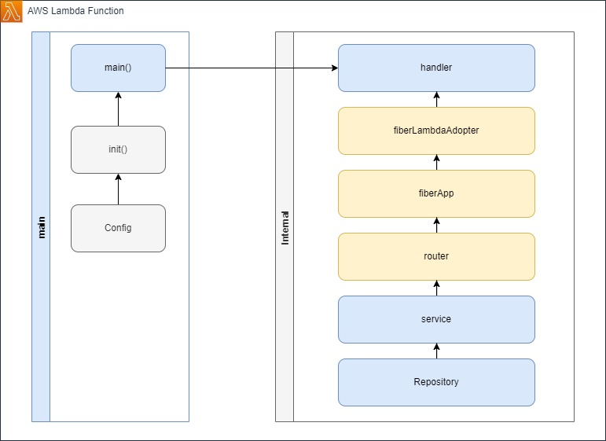
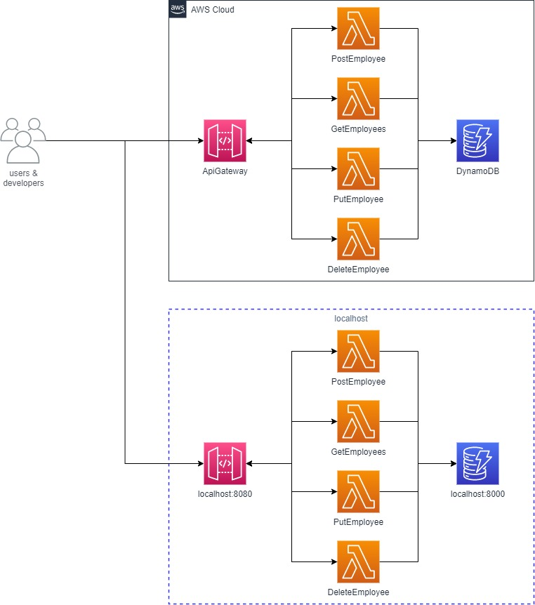

# aws-apigateway-lambda-clean-architecture
Clean Architecture of Golang AWS Lambda functions with DynamoDB and GoFiber

This project contains a sample CDK application of ApiGateway, Lambda Functions and DynamoDB. Key Focus of this repository is to describe the clean-architecture of go lambda project and to demonstrate running api locally.

In this example project, you can run same functions that you are going to deploy into aws locally and your functions can also interact with your local DynamoDB.


## ✅ Requirements 
* [Git](https://git-scm.com/book/en/v2/Getting-Started-Installing-Git) installed
* [Go](https://go.dev/doc/install) installed
* [Node and NPM](https://nodejs.org/en/download/) installed
* [NoSQL Workbench](https://docs.aws.amazon.com/amazondynamodb/latest/developerguide/workbench.settingup.html) installed
* [DynamoDBLocal.jar](https://docs.aws.amazon.com/amazondynamodb/latest/developerguide/DynamoDBLocal.DownloadingAndRunning.html) installed

## 🙄 Optoinal 
Since this project can be tested complete locally, AWS is optional in this case. But I recommend to deploy and compare the results on your own.
* [AWS account](https://portal.aws.amazon.com/gp/aws/developer/registration/index.html)
* [AWS CLI](https://docs.aws.amazon.com/cli/latest/userguide/install-cliv2.html) installed

## ✔️ Run Local DynamoDB in Terminal
When you have installed [DynamoDBLocal.jar](https://docs.aws.amazon.com/amazondynamodb/latest/developerguide/DynamoDBLocal.DownloadingAndRunning.html), then I would recommend to save following function in your shell to run local dynamoDB easily.

```
# To Run DynamoDb Local
function dynamo(){
 cd $USER/dynamolocal

 java -Djava.library.path=./DynamoDBLocal_lib/ -jar DynamoDBLocal.jar -sharedDb -port 8000
}
```
Whenever you run **dynamo** in your terminal, it will start to host your local dynamoDB on port 8000.

## ✔️ Set Up Employee Table in NoSQL Workbench
Employee Table is one of the sample data models of NoSQL Workbench. 

1. In main tab of the application, select **Employee Data Model** and click **import**. 

2. Click **Visualize data model** button. 

3. Click **Commit to Amazon DynamoDB**

4. Select your localhost and **commit**. 

This sample data model Employee will be committed into your local DynamoDB and you can have seed data to test your CRUD operations.

## ✨ Clean Architecture
### Key idea
Programmers realize the optimal architecture for an application after most of the code has been written. 

> A good architecture allows decisions to be delayed to as late as possible.

### Rule of Clean Architecture by Uncle Bob
 * Independent of Frameworks. The architecture does not depend on the existence of some library of feature laden software. This allows you to use such frameworks as tools, rather than having to cram your system into their limited constraints.
 * Testable. The business rules can be tested without the UI, Database, Web Server, or any other external element.
 * Independent of UI. The UI can change easily, without changing the rest of the system. A Web UI could be replaced with a console UI, for example, without changing the business rules.
 * Independent of Database. You can swap out Oracle or SQL Server, for Mongo, BigTable, CouchDB, or something else. Your business rules are not bound to the database.
 * Independent of any external agency. In fact your business rules simply don’t know anything at all about the outside world.

 More at https://8thlight.com/blog/uncle-bob/2012/08/13/the-clean-architecture.html

### The main principle
Dependency Inversion (the same one from SOLID) is the principle of dependency inversion.
The direction of dependencies goes from the outer layer to the inner layer.
Due to this, business logic and entities remain independent from other parts of the system.

This project has 5 main layers :
 * Models Layer (entities / response)
 * Repository Layer 
 * Usecase Layer (Service Layer)
 * Routing Layer
 * Delivery Layer (Handler, fiberApp/Adopter)

### Layers



## ✨ Usecase
Architecture is simple. CDK defines an ApiGateway with single endpoint of **employees**. To this endpoint lambda functions are attached to run CRUD operations with DynamoDB.

Exactly same functionality of this AWS Services, however, can be hosted complete locally via **fiber** and **NoSQL Workbench**. 




## 🔥 Deploy

1. Clone the project to your local working directory
```
git clone https://github.com/deloittepark/aws-serverless-golang.git
```

2. Change the working directory to cdk's directory
```
cd apigw-lambda-clean-architecture/cdk
```

3. Install dependencies
```
npm install
```

4. This project uses typescript as client language for AWS CDK. Run the given command to compile typescript to javascript
```
npm run build
```

5. Bootstrap your account with following command
```
npx aws-cdk bootstrap --toolkit-stack-name 'CDKToolkit-Golang-Fiber' --qualifier 'fiber' --cloudformation-execution-policies 'arn:aws:iam::aws:policy/AdministratorAccess' aws://<YOUR_AWS_ACCOUNT_ID>/<REGION> 
```

6. Synthesize CloudFormation template from the AWS CDK app
```
cdk synth
```

6. Deploy the stack to your default AWS account and region. The output of this command should give you the URL of the ApiGateway, which you can invoke via terminal or Postman
```
cdk deploy
```
## 🚀 Local Test

You can run this services without deploying into AWS Environment complete locally.

1. In your terminal, run **dynamo** or following command, if you haven't set up **dynamo** function in your shell.
```
java -Djava.library.path=./DynamoDBLocal_lib/ -jar DynamoDBLocal.jar -sharedDb -port 8000
```

2. Go to directory api/cmd/getEmployees

3. Start your api locally
```
env=local go run main.go
```

4. In Terminal you can test follwoing command to create employee in your locally hosted DynamoDB
```
curl --location --request POST 'http://127.0.0.1:8080/employees' \
--form 'loginAlias="test"' \
--form 'firstName="hello"' \
--form 'lastName="world"' \
--form 'managerLoginAlias="N.A"'
```
## 🔨 Cleanup

Run the given command to delete the resources that were created. It might take some time for the CloudFormation stack to get deleted. This will delete all deployed resources including cloudwatch lamdba log groups. 🌳🌎🌈
```
cdk destroy
```

## 👀 References

1. ☁️ [awslabs/aws-lambda-go-api-proxy](https://github.com/awslabs/aws-lambda-go-api-proxy)

2. ⚡ [gofiber](https://github.com/gofiber/fiber)
