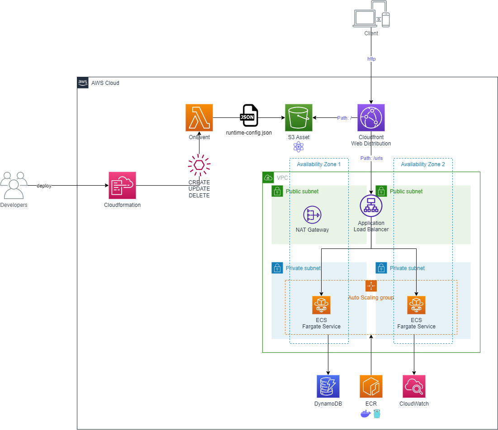

# cloudfront-ecs-url-shortener-app

In **ecs-url-shortener** project, I will demonstrate a fullstack demo application with dockerized api with golang, dynamodb and  react application. You can run this application completely locally and this project is a base for the future migration project to AWS.

It does not contain any Infrastructure for AWS, but this project will be reused in the future as base and in next coming project, I will demonstrate first with ECR then with ECS and finally with EKS.

The React Application in this project is based on [url-shotener-frontend-ts](https://github.com/aditya-singh9/url-shotener-frontend-ts). Special thanks to [adity](https://www.adityasingh.tech/) ❤️

## 💡 Description 
Usecase of the url shortener is to reaplace original domain to easily typable and user friendly short url, in order to display this url with clients inside/outside of the application.

- First, enter the url, which you want to shorten in input field. 


- Second, click the generated url, it will redirect you to the original url.


## ✅ Requirements 
* [Git](https://git-scm.com/book/en/v2/Getting-Started-Installing-Git) installed
* [Go](https://go.dev/doc/install) installed
* [Docker](https://www.linkedin.com/feed/update/urn:li:activity:6997864787439140864/) installed
* [Node and NPM](https://nodejs.org/en/download/) installed
* [AWS account](https://portal.aws.amazon.com/gp/aws/developer/registration/index.html)
* [AWS CLI](https://docs.aws.amazon.com/cli/latest/userguide/install-cliv2.html) installed


## ✨ Architecture
For migration to AWS of containerized app application, I have chosen to host web application using cloudfront and backend api in ecs. Since react application needs a dynamic runtime config file to fetch the api endpoint after deployment, I have used custom resource lambda function to write runtime-config.json to S3 Frontend Asset Bucket during Deployment. [learn more](https://github.com/deloittepark/aws-serverless-golang/tree/main/cognito-react-runtime-config)




## ✨ DynamoDB
DynamoDB Schema is quiet simple. Capability of this table is to hold 1:1 relation between original url and generated short url. As analysis purpose I have added hitCounter attribute, which will be counted up everytime, when user requested to retrieve original url from DynamoDB. Id Key is saved using hashed value in DynamoDB, so there will be only one entry for each url.

### Main Table

### GSI Table 


## 🔥 Deploy
1. Clone the project to your local working directory
```
git clone https://github.com/deloittepark/aws-serverless-golang.git

```
2. Change the working directory to ui's directory
```
cd ecs-url-shortener-migration/ui
```

3. Install dependencies
```
npm install
```

4. Run the given command to compile typescript to javascript
```
npm run build
```

5. Change the working directory to cdk's directory
```
cd ecs-url-shortener-migration/cdk
```

6. Install dependencies
```
npm install
```

7. This project uses typescript as client language for AWS CDK. Run the given command to compile typescript to javascript
```
npm run build
```

8. Bootstrap your account with following command
```
npx aws-cdk bootstrap --toolkit-stack-name 'CDKToolkit-Golang-Demo' --qualifier 'demo' --cloudformation-execution-policies 'arn:aws:iam::aws:policy/AdministratorAccess' aws://<YOUR_AWS_ACCOUNT_ID>/<REGION> 
```

9. Synthesize CloudFormation template from the AWS CDK app to validate
```
cdk synth
```

10. Deploy the stack to your default AWS account and region.
```
cdk deploy --require-approval never
```

7. After deployment of the stack, cloudfront domain will be printed as output of stack deployment. You can enter this domain in your browser


## 🚀 Start Application Locally
```
1 Go to ui folder
create runtime-config.json file in public folder

2. Copy paste following json
{
 "apiEndpoint": "http://localhost:8080"
}

3 Go to project root

4 Run docker compose
docker compose up
```

DynamoDB will be hosted in port 8000 and your go-fiber api application will be hosted in port 8080.

1. Health Check with Get Call
```
curl --location --request GET 'http://localhost:8080/urls'
```

2. Create your fancy Url with Post (you can replace the url in form data)
```
curl --location --request POST 'http://localhost:8080/urls' \
--form 'url="https://www.linkedin.com/in/junghwa-park-279129235"'
```

This Post call will return you an object with ID, Url and Path. Copy the Path value for next step.

3. Open Browser and Test your Url
```
http://localhost:8080/urls/<PATH_VALUE_FROM_STEP2>
```

4. Your url will be redirected to the original Url, which you have created in step 2.


During the steps, I will explain the services like ECR, ECS and EKS more in details and will explain about usecases. 

## 👀 References

1. ☁️ [aws-workshop](https://containers-cdk-react-amplify.ws.kabits.com/)

2. ⚡ [ECS Fargate Application](https://exanubes.com/blog/ecs-fargate-deployment)

3. 🐱‍💻 [url-shotener-frontend-ts](https://github.com/aditya-singh9/url-shotener-frontend-ts)
